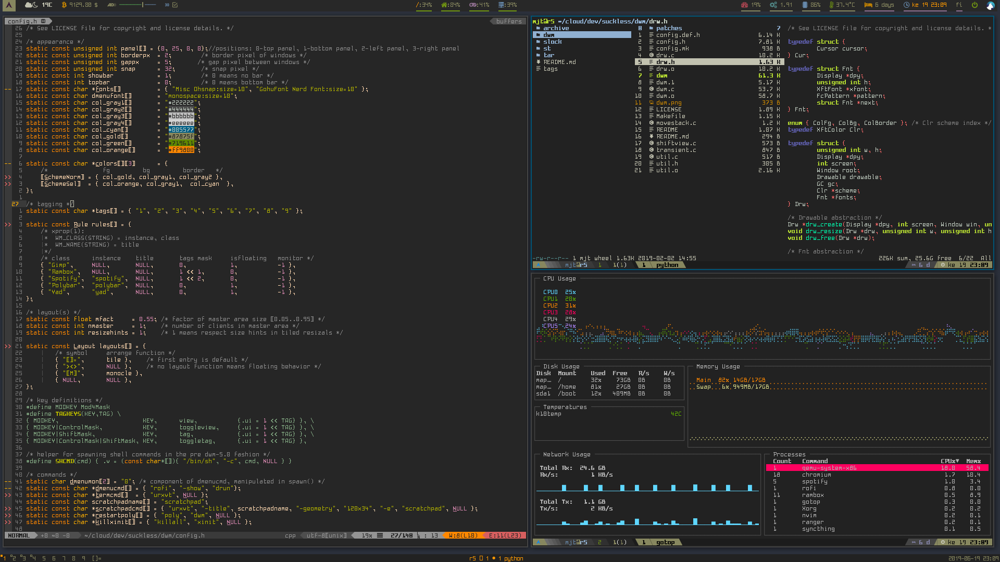

# dwm - dynamic window manager
Personal build of [dwm](https://dwm.suckless.org/) version 6.2.

[Patches used](./patches)



Added make option ```make binary``` compiles and installs only the binary itself to the ~/bin so its easy to for example write script and bind it to some keybinding to easily update configurations.
